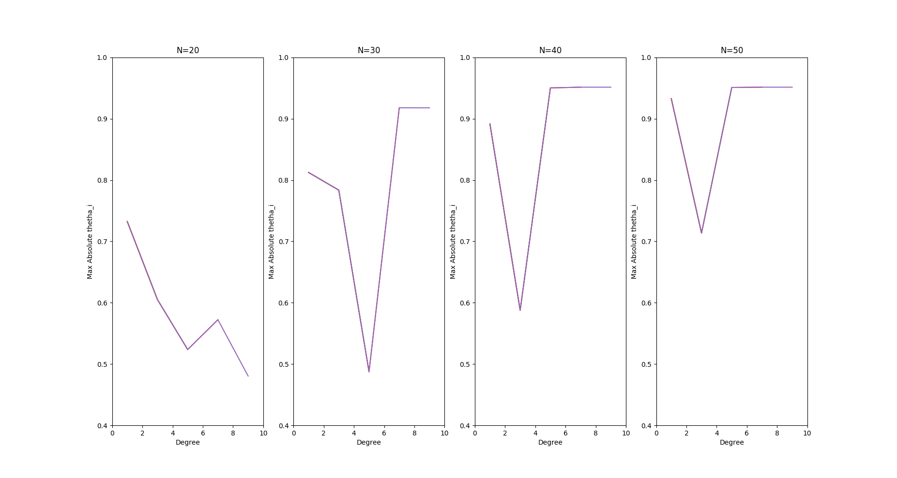

# ES654-2020 Assignment 3
*Kavita Vaishnaw* - *17110073*

------

> Write the answers for the subjective questions here 

 
Conclusion:  
As N increases, the max absolute value of thetha is increasing since the plot of thetha vs d is moving upwards. 

