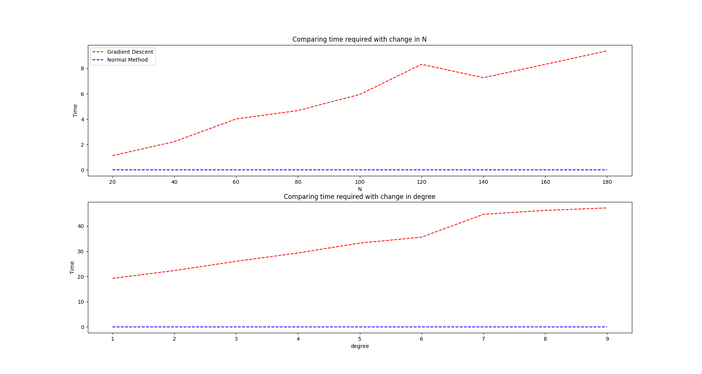

# ES654-2020 Assignment 3

*Kavita Vaishnaw* - *17110073*

------

> Write the answers for the subjective questions here 

 
Conclusion: 
The theoretical time complexities for normal method is O(n*(d^2)+d^3) and for gradient descent is O(ndt)  
When N (no. of samples) varies, both plots should be linear. This is true for our case as well.  
When d(no. of features) varies, normal method should growing cubic in d, while gradient descent should grow linearly. The plot mathes the theory for gradient descent.  
